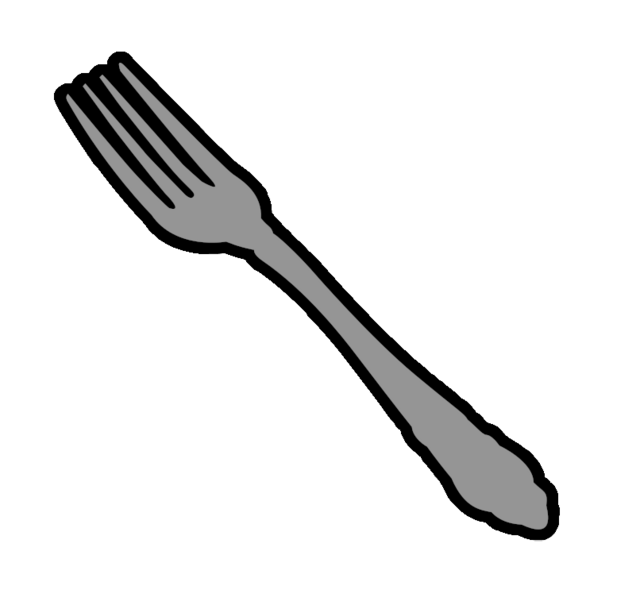

# Bundled Icons

Cope and Drag includes the following built-in icons for ease of use. To use any of these icons,
just use the icon path below in your CnD spec.

```yaml
directives:
  - icon:
      selector: Apple
      path: /img/builtin/apple.png
```

| Icon                              | Icon Path                     |
|-----------------------------------|-------------------------------|
|        | `/img/builtin/apple.png`     |
|          | `/img/builtin/eye.png`       |
|         | `/img/builtin/fork.png`      |
|         | `/img/builtin/nose.png`      |
|         | `/img/builtin/wolf.png`      |
|       | `/img/builtin/banana.png`    |
|      | `/img/builtin/eyebrow.png`   |
|         | `/img/builtin/goat.png`      |
|         | `/img/builtin/pear.png`      |
|        | `/img/builtin/mouth.png`     |
|       | `/img/builtin/person.png`    |
|         | `/img/builtin/fish.png`      |