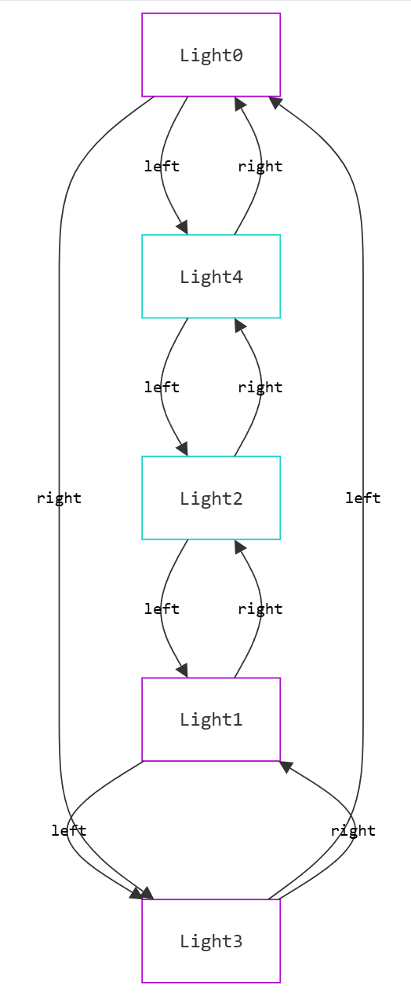
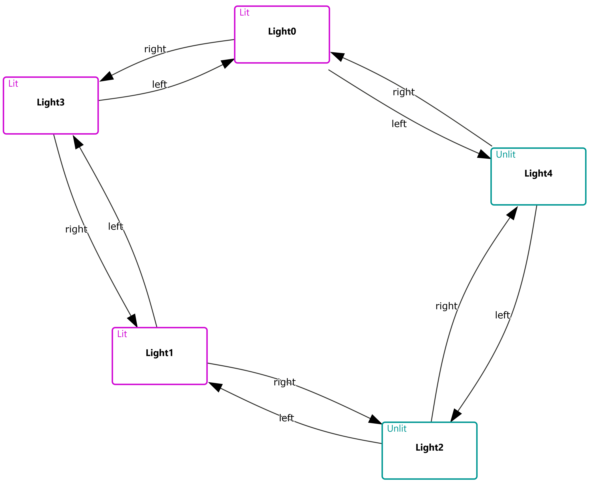
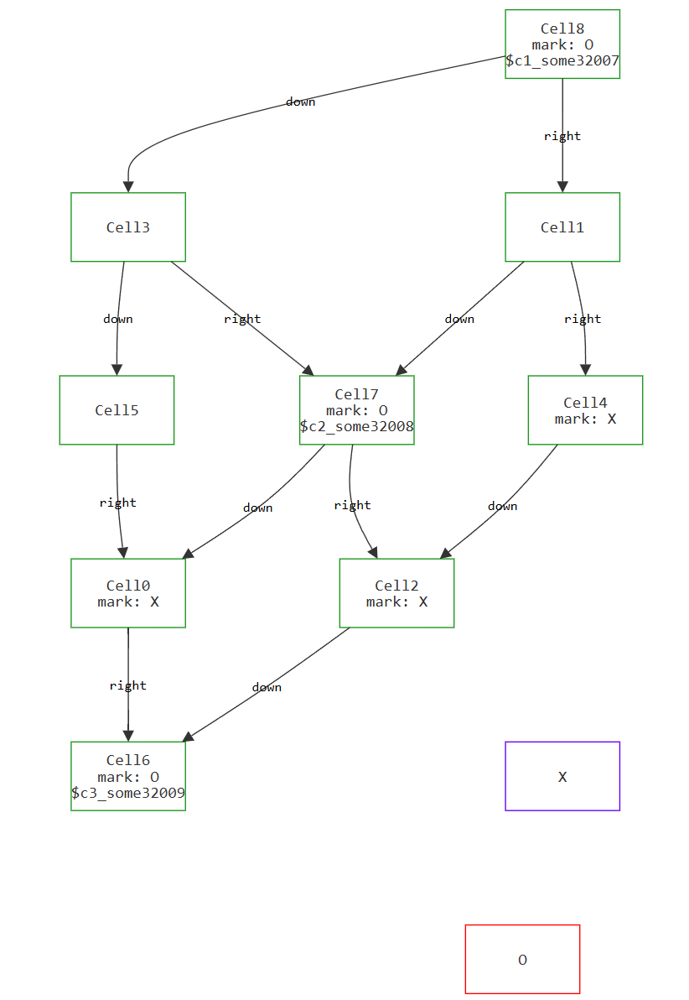
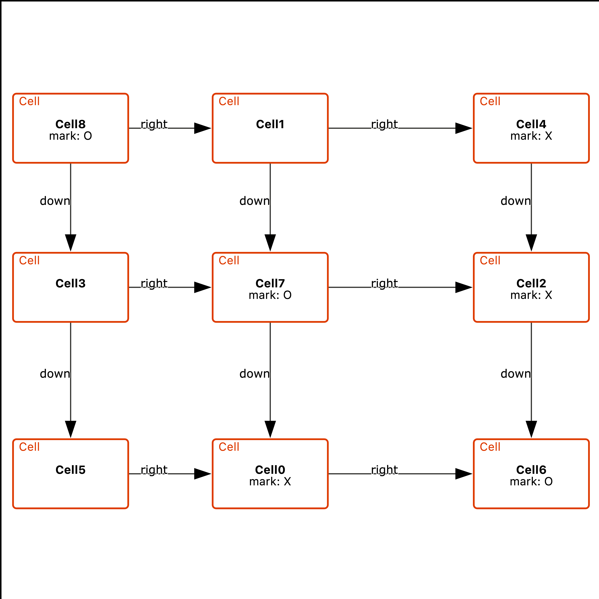
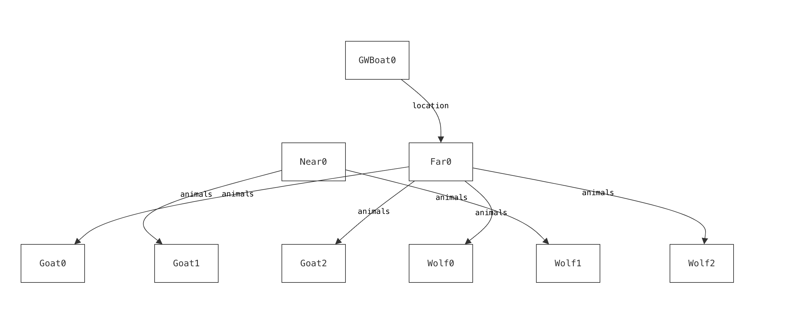
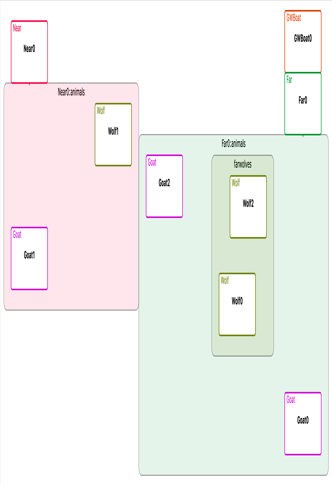

# Constraints
Constraints define spatial relationships between elements in the diagram. Each constraint consists of a **type** and associated **parameters**.

## **Cyclic Constraints**
Cyclic constraints arranges elements related by a field in a circular layout. For example, the constraint below converts the image on the left to that on the right.


<div style="display: table; width: 100%; text-align: left;">

  <!-- Left Image -->
  <div style="display: table-cell; width: 33%; vertical-align: middle;">
    
  </div>

  <!-- Code Block -->
  <div style="display: table-cell; width: 33%; vertical-align: middle; padding: 0 10px;">
<pre><code>
constraints:
  - cyclic:
      field: left
      direction: clockwise  
      appliesTo: [Node, Node]
    </code></pre>
  </div>

  <!-- Right Image -->
  <div style="display: table-cell; width: 33%; vertical-align: middle;">
    
  </div>

</div>


#### Parameters

- `field` : Name of the field in the source specification upon which the constraint acts
- `direction` : [Optional] Direction in which elements will be laid out. One of `clockwise` or `counterclockwise`. Defaults to `clockwise`
- `appliesTo` : [Optional] List of the form [`sourceSig`, `targetSig`] , describing output graph edges to which this constraint applies. Defaults to [`univ`, `univ`] (that is, all types).


## **Orientation Constraints**
Specify the relative positioning of elements.

### Orientation for Fields

The following orientation constraints lay out elements related by a field named `down` directly below one another,
and elements related by the field named `right` to be directly right of one another. This transforms the Sterling output on the left to that on the right.

<div style="display: table; width: 100%; text-align: left;">

  <!-- Left Image -->
  <div style="display: table-cell; width: 33%; vertical-align: middle;">
    
  </div>

  <!-- Code Block -->
  <div style="display: table-cell; width: 33%; vertical-align: middle; padding: 0 10px;">
<pre><code>
constraints:
  - orientation:
      field: down
      directions:
        - directlyBelow
  - orientation:
      field: right
      directions:
        - directlyRight
    </code></pre>
  </div>

  <!-- Right Image -->
  <div style="display: table-cell; width: 33%; vertical-align: middle;">
    
  </div>

</div>


#### Parameters

- `field` : Name of the field in the source specification upon which the constraint acts.
- `directions` : Directions in which elements will be laid out. List of directions, which can be
                `left`, `right`, `above`, `below`, `directlyAbove`, `directlyBelow`, `directlyLeft`, `directlyRight`.

- `appliesTo` : [Optional] List of the form [`sourceSig`, `targetSig`] , describing output graph edges to which this constraint applies. Defaults to [`univ`, `univ`] (that is, all types).

### Orientation for Sigs

Alternatively, orientation can apply to entire sigs, defining constraints between all atoms of certain sig types.

```yaml
constraints:
  - orientation:
      sigs: [A, B]
      directions: [above, left]
```


#### Parameters

- `sigs` : List of sig names the source specification upon which the constraint acts. This list can have exactly 2 elements.
- `directions` : Directions in which elements will be laid out. List of directions, which can be
                `left`, `right`, `above`, `below`, `directlyAbove`, `directlyBelow`, `directlyLeft`, `directlyRight`.


## **Grouping Constraints**
Group elements together based on a field. The constraint below groups elements on the `domain` of the `animal` field. This transforms the Sterling output on the left to the output on the right.

Grouping removes multiple edges between the group source(s) and target(s), and replaces them with the lowest number of arrows between group and element. Groups **cannot** intersect unless one is subsumed by another.

<!-- ```yaml
constraints:
    - group: 
        field: animals
        target: domain
``` -->

<div style="display: table; width: 100%; text-align: left;">

  <!-- Left Image -->
  <div style="display: table-cell; width: 33%; vertical-align: middle;">
    
  </div>

  <!-- Code Block -->
  <div style="display: table-cell; width: 33%; vertical-align: middle; padding: 0 10px;">
<pre><code>
constraints:
    - group: 
        field: animals
        target: domain
    </code></pre>
  </div>

  <!-- Right Image -->
  <div style="display: table-cell; width: 33%; vertical-align: middle;">
    
  </div>

</div>


#### Parameters

- `field` : Name of the field in the source specification upon which the constraint acts.
- `target` : [Optional] Which part of the field relation is grouped *upon*. Can be `range`  or `domain`. Default is `range`.


# When Constraints Cannot Be Satisfied

All CnD constraints are **hard constraints**, and thus must be satisfied for a diagram to be produced. Constraints might not be satisfied for one of two reasons:

**A single CnD constraint definition could be inherently unsatisfiable.** For example, a constraint on the `next` field that requires the same field to be laid out both leftwards and rightwards:

```yaml
- orientation:
    field: next
    directions: [right, left]
```

This represents a bug in the CnD spec, and can be identified statically. In this case, CnD produces an error message in terms of the constraints that could not be satisfied:

```
Error: Inconsistent orientation constraint:
Field `next` cannot be laid out with directions: right, left.
```


**Some constraints may be individually satisfiable, but become contradictory when laying out a specific instance.** This is akin to a dynamic error, as it depends on the structure of the instance being visualized. For example, consider the constraints:

```yaml
- orientation:
    sigs: [X, Y]
    directions: [below]
- orientation:
    sigs: [Y, Z]
    directions: [below]
- orientation:
    sigs: [Z, X]
    directions: [below]
```
If an instance’s elements form a cyclic dependency, the constraints become unsatisfiable. However, an instance may lack atoms of, say, `Z`, in which case the constraints are satisfiable.


In both these cases, CnD **does not produce a diagram**. Instead, it provides an error message explaining that the constraints could not be met. 
