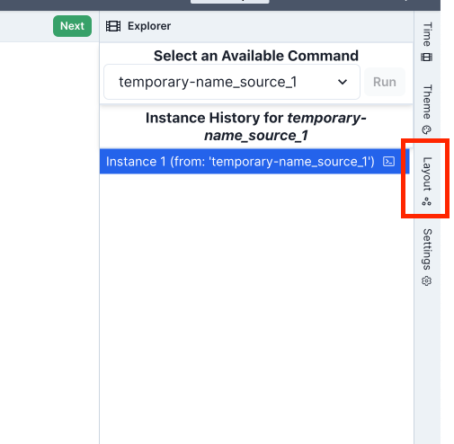

# Getting Started

> This guide assumes you have a basic understanding of the Forge language. If you need an introduction to Forge,
> check out the [Forge language documentation](https://csci1710.github.io/forge-documentation/getting-started/installation.html).

Here's how to get started:

1. Install the [Forge VS Code Extension](https://marketplace.visualstudio.com/items?itemName=SiddharthaPrasad.forge-language-server)
2. The extension will automatically start CnD at [`localhost:3000`](http://localhost:3000). Alternative setup: Download `CnD` from [GitHub releases](https://github.com/sidprasad/copeanddrag/releases) and run `node index.js`

---

## Basic Usage

1. Run a Forge specification that includes a `run` statement (an example is available [here](https://github.com/tnelson/Forge/blob/main/forge/examples/oopsla24/goat_cabbage_wolf.frg)).
2. This will open up Sterling, the default Forge visualizer, in a browser window. 
Run your command, and then, once Sterling displays a graph, click the `Layout` drawer.
 Select `Load Layout` to lkoad the graph in Cope and Drag. If you already have a Cope and Drag specification, you can 
paste it in here before clicking load layout.

<figure>
    
    <figcaption style="text-align: center; margin-top: 5px;">Click the highlighted button to open the Sterling Layout Drawer</figcaption>
</figure>

3. CnD will now open in a different tab. You can now start adding **[constraints](constraints.md)** that define spatial relationships between elements and **[directives](directives.md)** that control visual styling and representation.
These can be expressed both via YAML and a structured, no-code interface. 
If you are just starting with `CnD`, we recommend beginning with the No Code interface.

<figure>
    
    <figcaption style="text-align: center; margin-top: 5px;">YAML Interface for Authoring Diagrams</figcaption>
</figure>

<figure>
    
    <figcaption style="text-align: center; margin-top: 5px;">No Code Interface for Authoring Diagrams</figcaption>
</figure>

4. Once you have clicked 'Apply Layout', `CnD` will apply your specification to generate a new diagram.

## Next Steps

- Read about [Constraints](constraints.md)
- Learn about [Directives](directives.md)