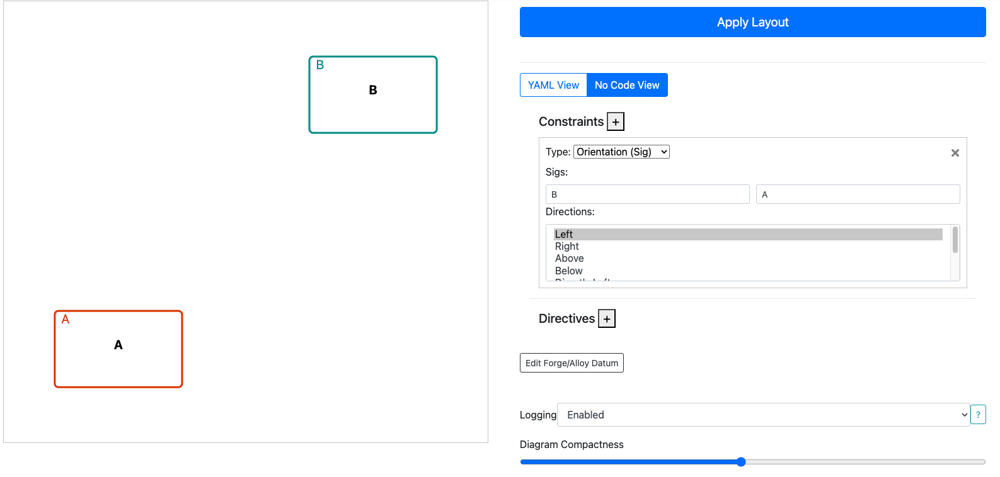

# Getting Started

## What do CnD specs look like?

A CnD specification consists of two primary components:

- **[Constraints](constraints.md)** that define spatial relationships between elements.
- **[Directives](directives.md)** that control visual styling and representation.

These can be expressed both via YAML and a structured, no-code interface. `CnD` automatically translates
specifications between these two representations.

<figure>
    
    <figcaption style="text-align: center; margin-top: 5px;">YAML Interface for Authoring Diagrams</figcaption>
</figure>

<figure>
    
    <figcaption style="text-align: center; margin-top: 5px;">No Code Interface for Authoring Diagrams</figcaption>
</figure>

---

## Installing CnD

- `CnD` is built as an easy to install webserver! Download `CnD` from [Releases](https://github.com/sidprasad/copeanddrag/releases), and launch it by running `node index.js`. This will make the `CnD` server available on `localhost:3000`.

- `CnD` is also bundled with the [Forge VS Code Extension](https://marketplace.visualstudio.com/items?itemName=SiddharthaPrasad.forge-language-server)

