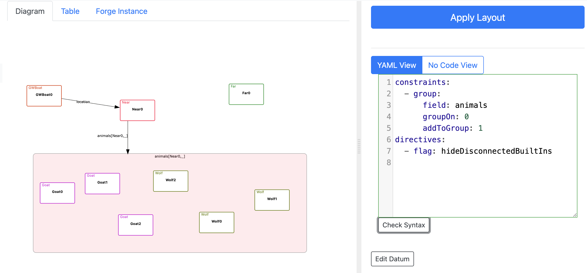
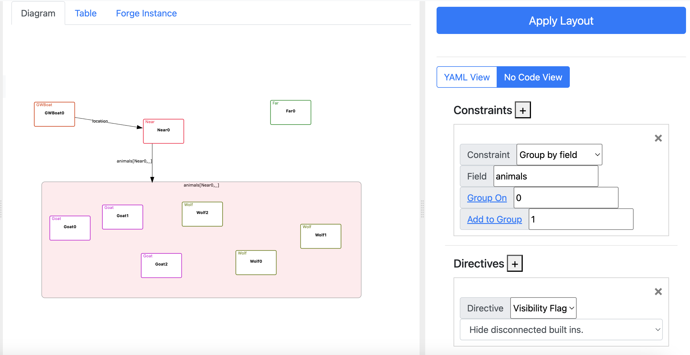
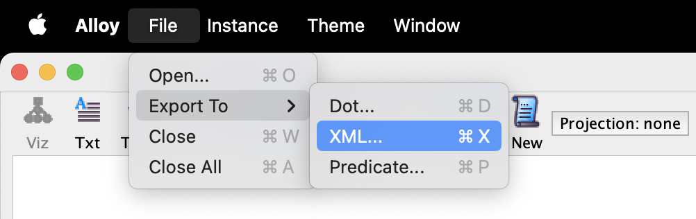

# Getting Started

> CnD is integrated into the [Forge](https://forge-fm.org) pedagogic model finder, which is heavily inspired by the [Alloy](https://alloytools.org) tool and language. 
> This guide assumes you have a basic understanding of Forge or Alloy. If you need an introduction to Forge,
> check out the [Forge documentation](https://forge-fm.github.io/forge-documentation/).

## Installing CnD

You can install CnD in one of the following ways:

1. A stable, but less often updated version of CnD is packaged with the [Forge VS Code Extension](https://marketplace.visualstudio.com/items?itemName=SiddharthaPrasad.forge-language-server). This automatically launches CnD at [`localhost:3000`](http://localhost:3000).
2. **NPM**: CnD is available as an [NPM package](https://www.npmjs.com/package/cope-and-drag). You can install and launch CnD as follows:
```
npm i cope-and-drag # Install
copeanddrag --port 3000 # Port is optional, defaults to 3000
```

3. **From a specific GitHub release** : Download `CnD` from [GitHub releases](https://github.com/sidprasad/copeanddrag/releases) and run `node index.js`

---


## Running CnD with Forge

These instructions assume that you have an actively running `CnD` server **on port 3000**. If you are using the Forge VS Code Extension, you will not have to manually launch CnD.


1. Run a Forge specification that includes a `run` statement (an example is available [here](https://github.com/tnelson/Forge/blob/main/forge/examples/oopsla24/goat_cabbage_wolf.frg)).
2. This will open up Sterling, the default Forge visualizer, in a browser window. 
Run your command, and then, once Sterling displays a graph, click the `Layout` drawer.
 Select `Load Layout` to load the graph in Cope and Drag. If you already have a Cope and Drag specification, you can 
paste it in here before clicking load layout.


<figure>
    
    <figcaption style="text-align: center; margin-top: 5px;">Click the highlighted button to open the Sterling Layout Drawer</figcaption>
</figure>


1. CnD will now open in a different tab. You can now start adding **[constraints](/constraints)** that define spatial relationships between elements and **[directives](/directives)** that control visual styling and representation.
These can be expressed both via YAML and a structured, no-code interface. 
If you are just starting with `CnD`, we recommend beginning with the No Code interface.

<figure>
    
    <figcaption style="text-align: center; margin-top: 5px;">YAML Interface for Authoring Diagrams</figcaption>
</figure>

<figure>
    
    <figcaption style="text-align: center; margin-top: 5px;">No Code Interface for Authoring Diagrams</figcaption>
</figure>

4. Once you have clicked 'Apply Layout', `CnD` will apply your specification to generate a new diagram.

## Running CnD with Alloy

For the moment, the best way to use CnD with Alloy is by pasting the instance XML that Alloy produces into CnD directly. To do this:

1. From within Alloy's instance visualizer, select the `File -> Export To -> XML` menu option.

<figure>
    
    <figcaption style="text-align: center; margin-top: 5px;">Exporting an Alloy instance as XML</figcaption>
</figure>

2. Open the XML file in a text editor and copy its entire contents to clipboard. 

3. Click the `Edit Datum` button in the `CnD` Layout pane, then paste the XML into the edit box. 

4. Click `Apply Layout`. The instance will be displayed and `CnD` constraints and directives will be available for visualization. This includes selectors that use the (substantial) set of operators shared by both Forge and Alloy: join, set comprehension, cardinality, and so on.


## Next Steps

- Read about [Constraints](/copeanddrag/constraints)
- Learn about [Directives](/copeanddrag/directives)
